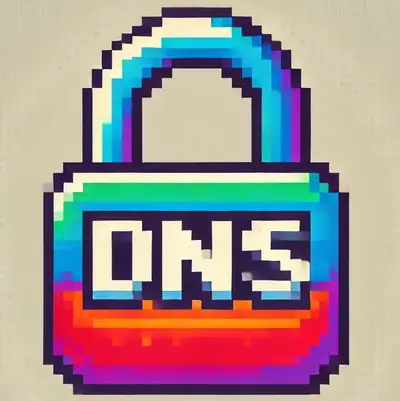

<!-- markdownlint-disable MD036 -->

# DNS-over-HTTPS



This is a fork of the original DNS-over-HTTPS project [https://github.com/m13253/dns-over-https](https://github.com/m13253/dns-over-https), with added support for caching DNS responses in Redis and highly secure container image.

Forked at version 2.3.3

## Environment

```bash
UPSTREAM_DNS_SERVER="udp:208.67.222.222:53"
BACKUP_UPSTREAM_DNS_SERVER="udp:1.1.1.1:53"
BACKUP_RETRY_INTERVAL="30"
DOH_HTTP_PREFIX="/getnsrecord"
DOH_SERVER_LISTEN_PORT="8053"
REDIS_URL="redis:6379"
DOH_SERVER_TIMEOUT="10"
DOH_SERVER_TRIES="3"
DOH_SERVER_VERBOSE="false"
```

### Backup upstream (failover)

`UPSTREAM_DNS_SERVER` can be a comma-separated list of **equivalent** resolvers. Those are used for load balancing / retries — every listed server is eligible on every query.

`BACKUP_UPSTREAM_DNS_SERVER` is different: it is only used when the preferred upstream is **unreachable** (timeout, connection refused, or no response). Valid DNS answers from the preferred server — including NXDOMAIN and SERVFAIL — do **not** fail over, so content filtering is not bypassed just because a name is blocked.

While the preferred upstream is down, all queries go to the backup. A background probe (`BACKUP_RETRY_INTERVAL`, default 30 seconds) checks the preferred server with a root `NS` query; any DNS response means it is reachable again and traffic switches back.

If you use a backup, consider a shorter `DOH_SERVER_TIMEOUT` (for example `2`) so the first failover does not wait the full default 10 seconds.

## Prod

### Kubernetes Kustomize

- Remember to update ingress.yaml with your own domain and certificate manager issuer
- Network policy is not included but highly recommended

```bash
kubectl apply -k kustomization/
```

### Compose

```bash
podman-compose up -d
```

### Podman Run

*requires redis endpoint to be available*

```bash
podman run --rm -d \
  --name dns-over-https \
  -e UPSTREAM_DNS_SERVER="udp:208.67.222.222:53" \
  -e DOH_HTTP_PREFIX="/getnsrecord" \
  -e DOH_SERVER_LISTEN_PORT="8053" \
  -e REDIS_URL="redis:6379" \
  -p 8053:8053/tcp \
  -p 8053:8053/udp \
  ghcr.io/stenstromen/dns-over-https:latest
```

## Dev

### Build

```bash
podman build -t dns-over-https:dev .
```

### Run

*requires redis endpoint to be available*

```bash
podman run --rm -d \
  --name dns-over-https \
  -e UPSTREAM_DNS_SERVER="udp:208.67.222.222:53" \
  -e DOH_HTTP_PREFIX="/getnsrecord" \
  -e DOH_SERVER_LISTEN_PORT="8053" \
  -e REDIS_URL="redis:6379" \
  -p 8053:8053/tcp \
  -p 8053:8053/udp \
  dns-over-https:dev
```

### Test

```bash
make test
```

## Binary

```bash
make build
```

## Todo

- [x] Podman-Compose with Redis and DNS-over-HTTPS
- [x] Kubernetes Deployment example with Redis and DNS-over-HTTPS
- [x] Integration Test
